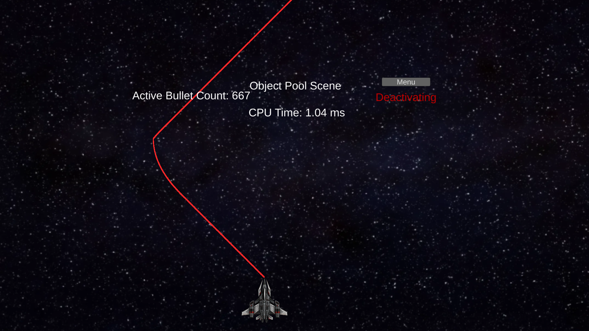
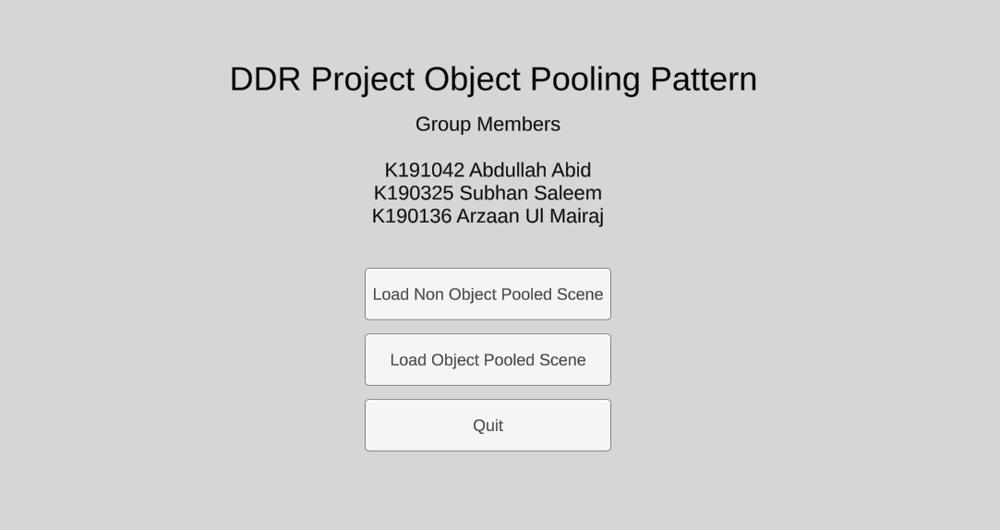

# DDR-Project

Group Members:

- 19K-1042 Abdullah Abid

- 19K-0325 Subhan Saleem

- 19K-0136 Arzaan Ul Mairaj

## Object Pooling Pattern

#### Intent

Object pool pattern is a software creational design pattern which is used in situations where the cost of initializing a class instance is very high, objects are reusable, and there is a need to initialize multiple instances many times. This pattern also helps when destroying an object has a high cost too. It serves as a cache of sort instead of having the garbage collector sweeping the unused objects.

#### Explanation

Object pool is basically a container which contains some arbitrary numbers of reusable already initialized objects. When the client needs an object the object pool class looks into its pool of object and returns an object which is currently not being used by any other class. When the client is done using the object, it is put back in the pool for others to use.

#### Disadvantages

The pattern is disadvantageous when we have to hold a lot of objects at a time in the pool, or object size is too big. Both of these situation results in high RAM usage depending on the application.

#### Class Diagram

### Our Implementation

We decided to implement the object pooling pattern in Unity game engine which uses C# as its scripting engine. It made sense to experiment with this pattern in a game engine because it is rare to have the need to initialize and destroy many objects quickly which hinders performance in usual desktop applications. But in games and related applications, we encounter this situation many times. The release build is available in the GitHub repository if you wish to run the game.

#### Methodology

We made two similar scenes in Unity. Each had a spaceship, controllable by arrow keys or wasd, shooting many small bullets every 0.003 seconds when we press and hold space. The bullet goes up on the screen and is destroyed after 2 seconds, enough time for it to go off screen. Why we choose that 0.003 number? Well, we will talk about that later. Both scenes had one difference between them though. One scene created the bullet objects and destroyed them normally when it needed to. The other used an object pool which already had a set amount of deactivated GameObjects of bullet (In Unity, we can use GameObject.setActive(boolean) to make an object appear/interact in the scene or to hide it). Scene took one from the pool, activated it, applied transforms, rotations, and movement vectors to it. When scene needed to destroy the object, it simply set deactivated the object. We logged the time between each generated frame to the screen for the user to inspect. The application also has a menu from which you can select what scene to open, pooled one, or the non pooled one.

#### Analysis

Unity editor gives us the option to run the scene in the editor for debug purposes. That is where we check and see if things are working and setup things. One problem with the "Play Mode" in the editor is inferior performance than a release build because it has to do debugging things. But that is advantegous for us because the object pooling pattern shines when processing performance is bad. We tested both scenes in the Play Mode in Unity editor.

We can see the difference in frame times between both the scenes. When we use Object Pooling pattern, we get a much better performance than mass instantiating and destroying objects.

In the release build, however, due to Unity's optimizations to code and creations of game objects, the difference was minimal between the two, object pool version and non object pool version. This was also due to us having high-end PCs, where we were achieving 1000-2000 frames per second in the game, which is quite high. Different PC hardware might result in a different outcomes.

Here, difference is within the margin of error, due to optimizations and performant hardware.

So, back to the question we raised earlier, why did we choose 0.003 seconds between spawning bullets. Well, because as stated in disadvantages of this pattern, object pooling pattern performs worse when the count of objects is very high since, to find an inactive object in the pool, it has to iterate over all of them to check each one. So, its really about judging the relation between object creation/destruction cost and cost of iterating over a lot of objects. We experimented with many values but found 0.003 seconds spawn time(or 670 objects) to be the sweet spot where we could demonstrate the difference in performance while not having degraded performance. Unity is pretty good at quickly creating/destroying objects. We had to go quite low to see any performance difference between pool and non pool versions. There was basically no performance difference when the object creating was 60 times per second (16.67 ms), the usual time step used in Update() method of game objects which is framerate dependent. We had to use FixedUpdate() method and set its time step in project setting to be as low as 0.003 ms.

#### Appendix

